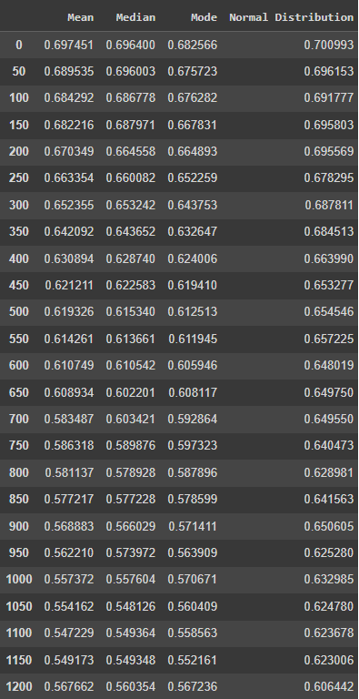

# NormalCleaning
This repository contains the code and data used to conduct a benchmark on data cleaning methods using normal distribution. The goal of this project was to compare the performance of different data cleaning methods, namely mean, median, and mode, in handling normal distributions.

## **Dataset**
The dataset used for this benchmark consists of a set of values generated from a normal distribution, which is available <href="https://www.kaggle.com/competitions/house-prices-advanced-regression-techniques/data">here</a>.

Data Cleaning Methods
In this project, I compared the performance of three different data cleaning methods on the normal distribution dataset, namely:

Mean
Median
Mode
I used these methods to clean the dataset and then compared the results to determine which method performed the best.

## **Results**
Based on the benchmarking results, normal distribution was found to be the best option among the compared data cleaning methods.

